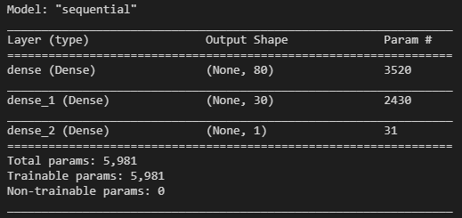

# Neural Network Charity Analysis

## Overview
Analyze the impact of each donation and vet potential recipients that a foundation is giving to companies around the world to protect the environment, improve people’s well-being, and unify the world. This kind of assessment is used to predict which organizations are worth donating to and which are too high risk. This task will be completed designing and using deep learning neural network using the Python TensorFlow library.

## Results  
### Data Processing
- The variable considered the target for this model is “IS_SUCCESSFUL” 

- The variables considered the features for this model are “APPLICATION_TYPE”, “AFFILIATION”, “CLASSIFICATION”, “USE_CASE”, “ORGANIZATION”, “STATUS”, “INCOME_AMT”, “SPECIAL_CONSIDERATIONS” and “ASK_AMT”.

- The variables that need to be removed from the input data are “EIN” and “NAME”

### Compiling, Training, and Evaluating the Model 
- There were two layers used and 80 neurons for the first layer and 30 neurons for the second layer.  There were two “ReLu” activation function used for the layers and a “sigmoid” activation function for the output. Since there are 43 input layers and one of several rule-of-thumb methods for determine number of neurons says that “The number of hidden neurons should be lees that twice the size of the input layer”, 80 neurons are used for the first layer.  The “Sigmoid” function was used for the output layer because the values were normalized to a probability between 0 and 1. 

- The model did not achieve the target performance accuracy higher than 75%. The model achieved 72.5%.

- There were additional steps taken in order to increase the model performance without reaching the objective. First step was to increase the number of epochs from 100 to 200. The second step was to increase the number of neurons to 120 for the first layer and 60 for the second layer. The third step was to increase to a third layer with 120 neurons for the first layer, 60 neurons for the second layer and 30 neurons for the third layer.  None of the steps described above give a boost in the performance accuracy. It kept under 75%.

## Summary
The result for this model is the 72.5% in accuracy and despite of several optimization the model behaves close to the same accuracy. The expected accuracy was higher than 75% what indicates that we need additional and complementary data to determine if the donations are worth. 
On the other hand, we can us The Random Forest model.  Since the data does not handle images or natural language and only handle tabular data, therefore the implementation of the random forest model allows us to use less code and faster performance that the neural network.  
